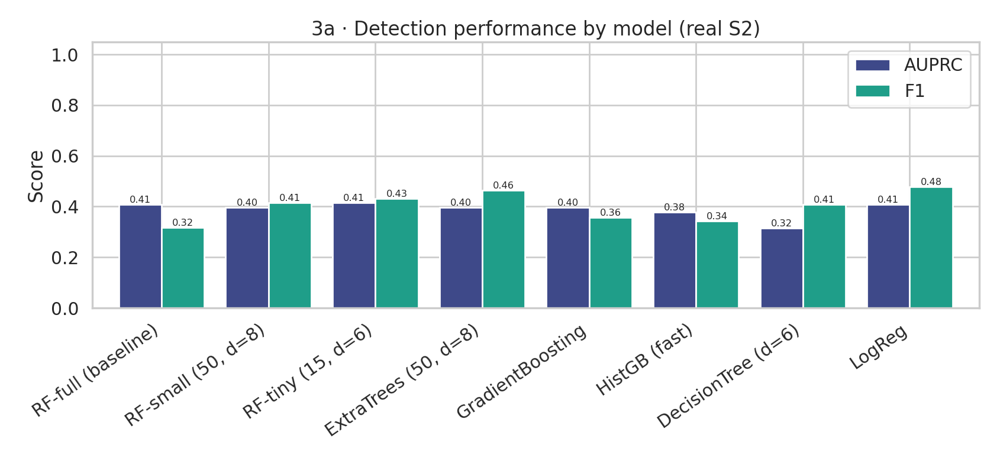
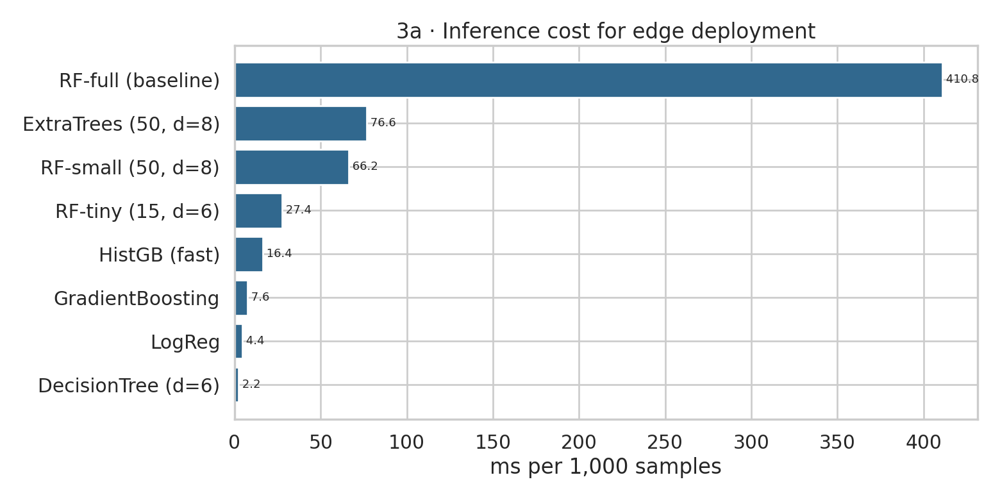
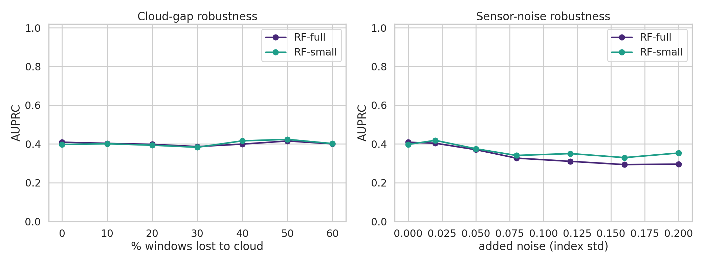
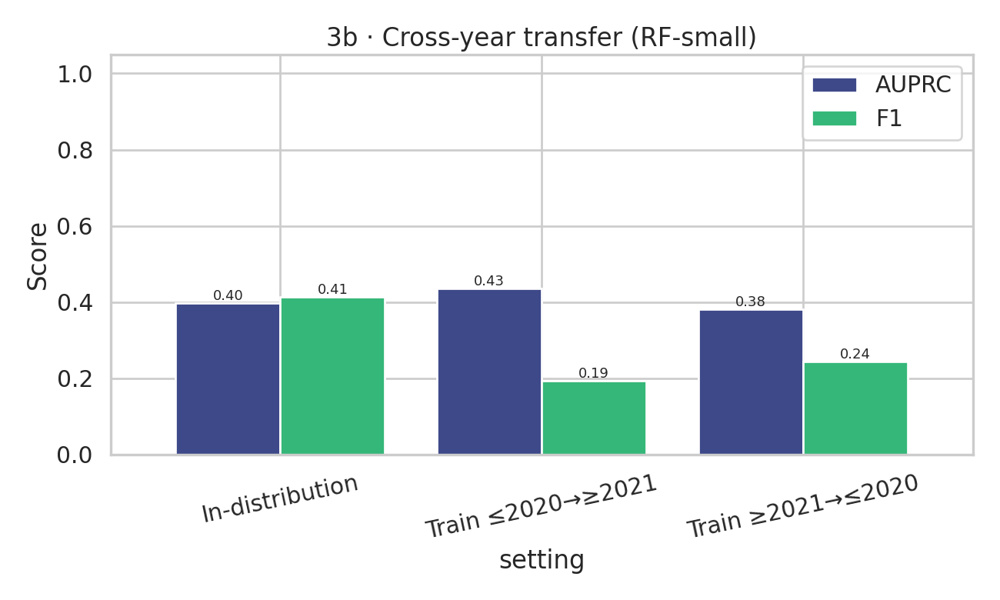
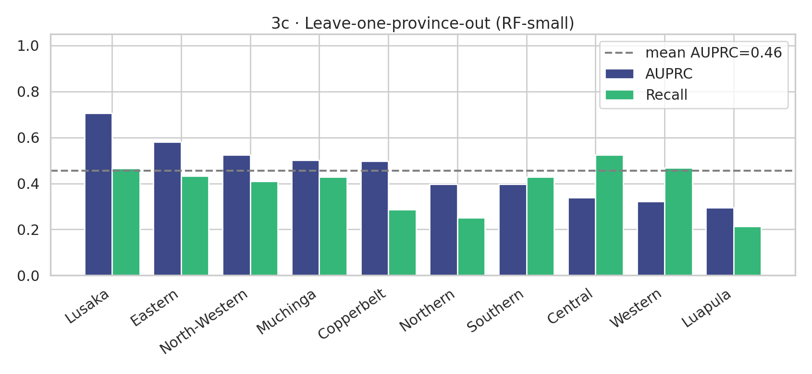
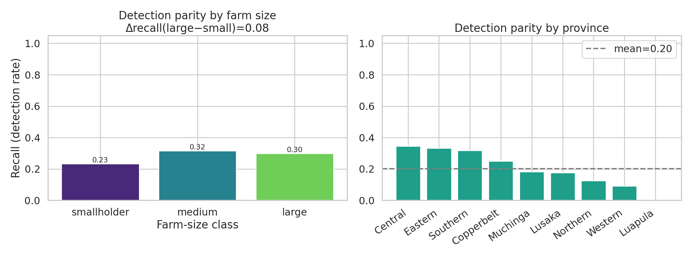
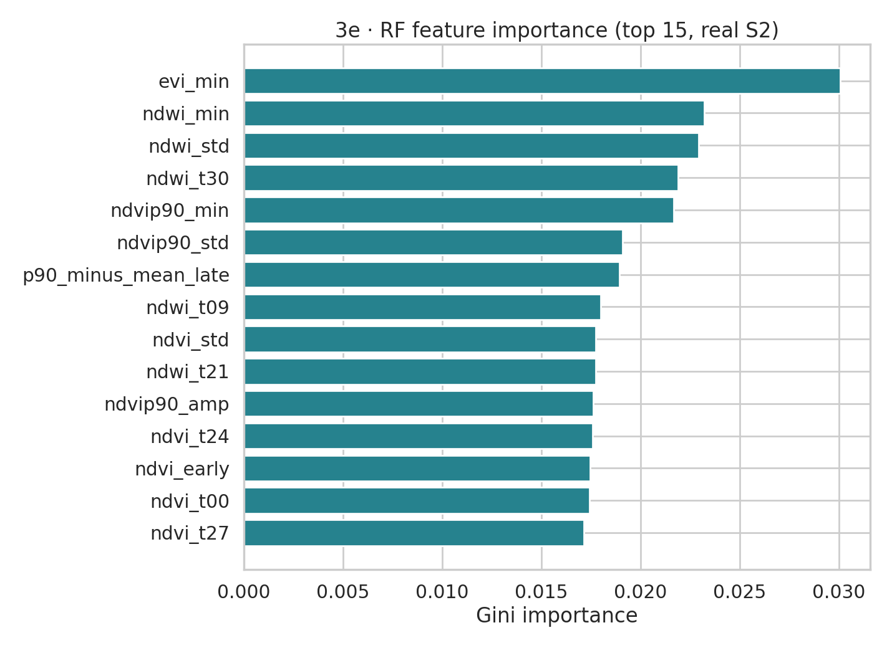
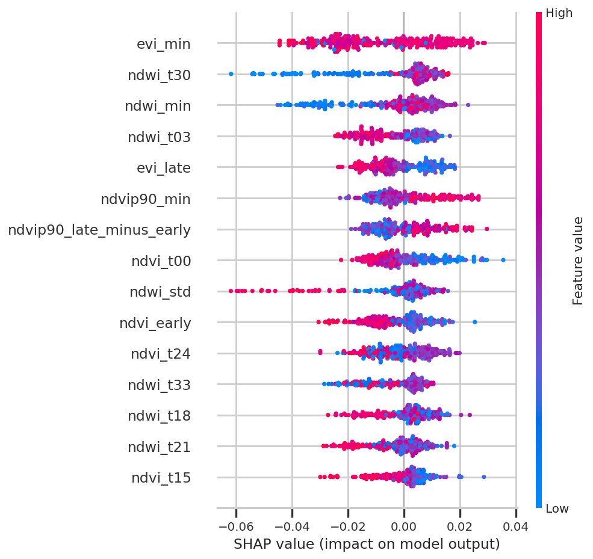

# Phase 3 — Extensions for Low-Resource, Responsible Irrigation Mapping

Reproducibility study of *“Mapping small-scale irrigation for climate adaptation.”*
Phase 3 takes the Phase 2 Random-Forest / Gradient-Boosting baseline and extends it toward
**low-resource deployment, robustness, fairness, and explainability** for smallholder farming
communities in Sub-Saharan Africa.

Everything lives in a single self-contained notebook:

### [`zambia_irrigation_phase3.ipynb`](zambia_irrigation_phase3.ipynb)

Runs end-to-end on the **real Sentinel-2 stacks** — download → feature build → train → all
Phase 3 analyses — on Kaggle or locally. It imports no other files in this repo.

## What it does

| Step | Description |
|------|-------------|
| 1. Download | Pulls the Sentinel-2 stacks from Kaggle (part1 + part2), or auto-detects them when run on Kaggle |
| 2. Labels | Loads `latest_irrigation_table.csv` and **dedupes to one row per image** (site+date) using the labeller priority **KL > MV > DSB > JL** |
| 3. Features | Reads each `*_stack_masked.tif` (420 bands = 10 bands × 42 decadal windows, band-major), computes per-window **NDVI / NDWI / EVI** (mean + 90th percentile to preserve small irrigated patches), and summarises each trajectory into a feature table |
| 4. Train | Reference Random-Forest baseline + a zoo of lightweight models, site-grouped train/test split (no spatial leakage) |
| 5a | **Lightweight models** — accuracy vs model size vs inference latency |
| 5b | **Robustness** — cloud-gap & sensor-noise degradation + cross-year transfer |
| 5c | **Cross-region** — leave-one-province-out generalisation |
| 5d | **Fairness** — smallholder vs large-farm detection (equal-opportunity recall parity) |
| 5e | **Explainability** — RF feature importance + SHAP |

All figures + result CSVs are written to `outputs/phase3/`.

## How to run (Kaggle — recommended)

1. **Create → New Notebook**, then **File → Import Notebook** and upload `zambia_irrigation_phase3.ipynb`.
2. **Add Input → Datasets**: attach both
   `wenhaolu49/zambia-smallholder-irrigation-sentinel2-part1` and `…-part2`.
3. Settings: **Accelerator = None**, **Internet = On**.
4. **Run All.** Feature extraction over ~2.7k stacks takes ~10 min (then cached); the rest is a few minutes.

## How to run (local)

Needs a Kaggle API token at `~/.kaggle/kaggle.json`; cell 2 downloads + unzips both datasets
(~38 GB) into `data/features/`. Then runs identically.

## Figures (illustrative)

The PNGs checked in here (`3a_*`–`3e_*`) are an **illustrative** copy of the figure set. The
notebook regenerates them with real numbers on each run.

| | |
|---|---|
|  |  |
|  |  |
|  |  |
|  |  |

## Notes

- **Granularity:** Phase 3 aggregates to **image-level** features (one row per labelled image),
  capturing small-farm signal via per-window percentile features. The paper/Phase 2 baseline is
  pixel-level; image-level is lighter and is the natural granularity for the farm-size and
  region fairness analyses (those attributes are per-image).
- **Reproducibility:** the feature build caches trajectories to `outputs/phase3/real_trajectories.npz`,
  so re-runs are fast and deterministic (`RNG = 42`).
