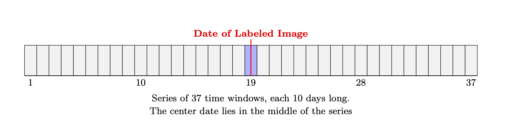
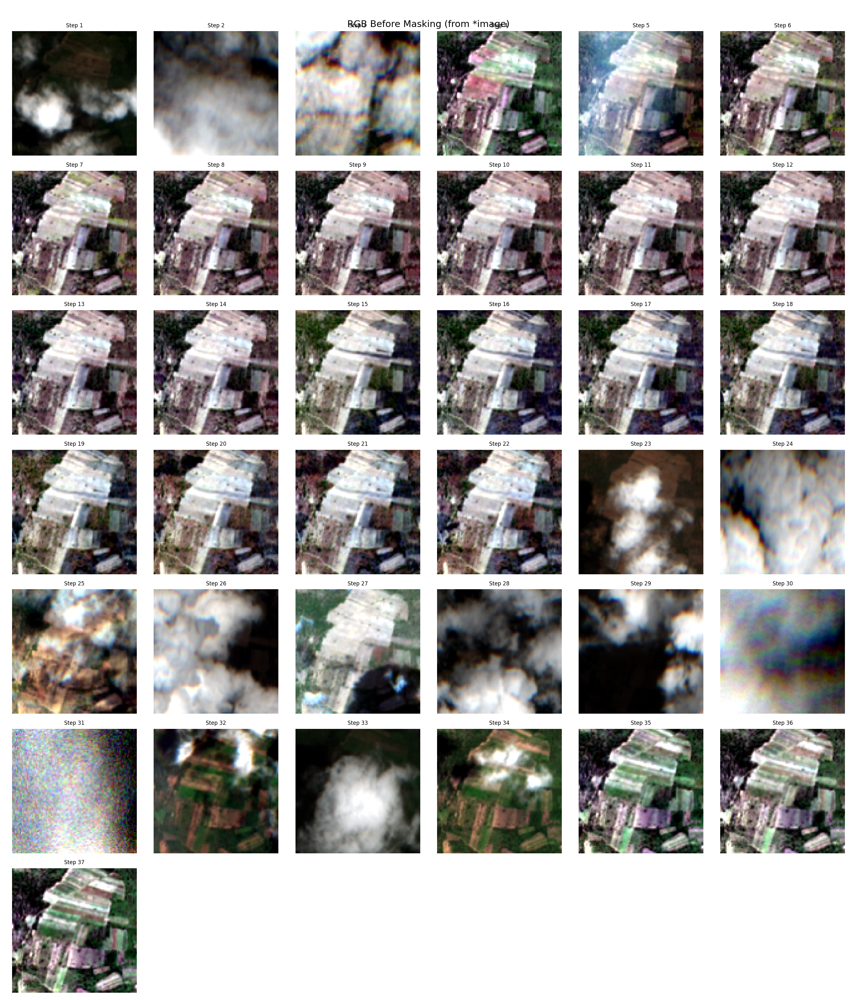
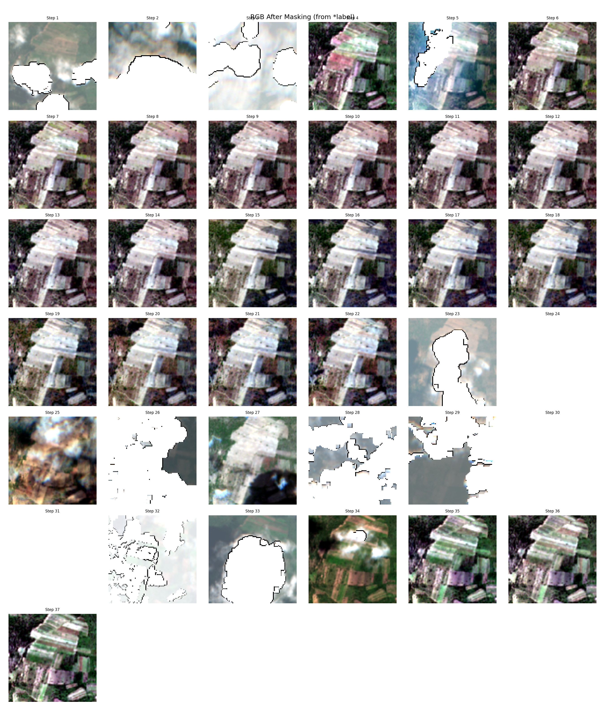
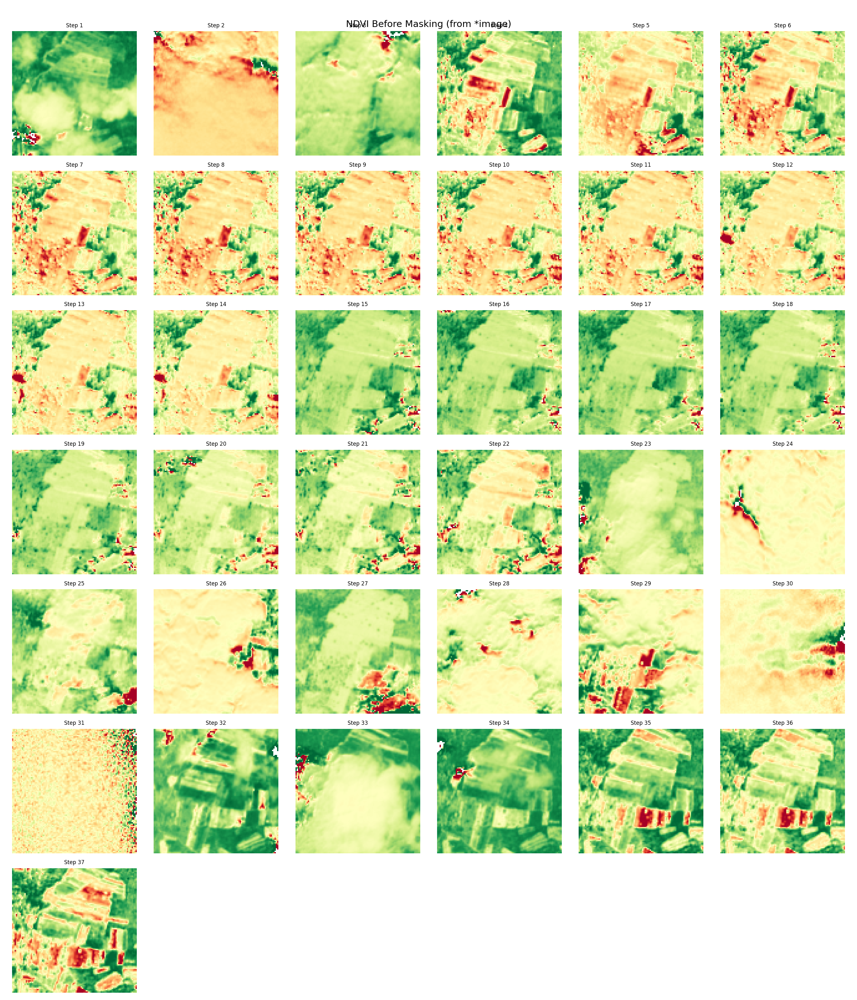
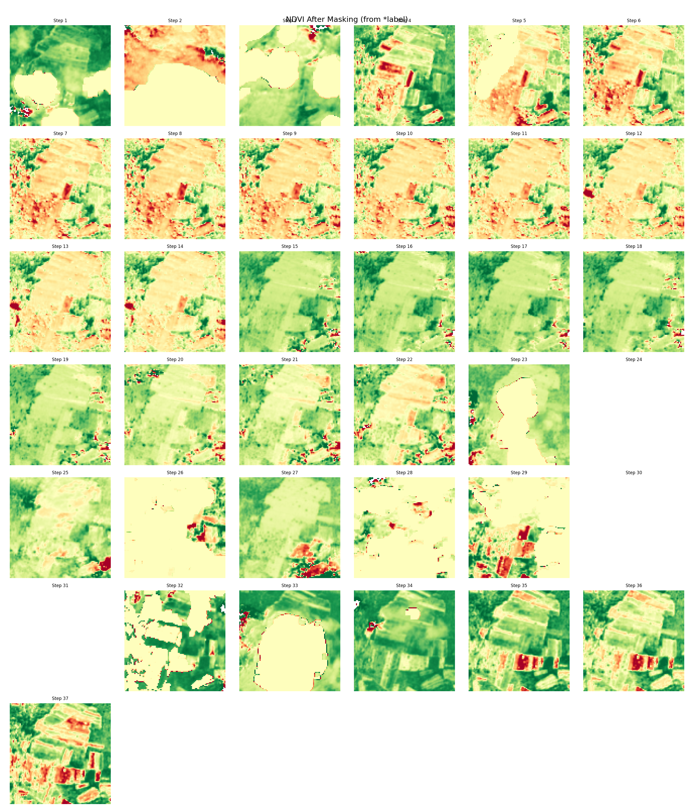
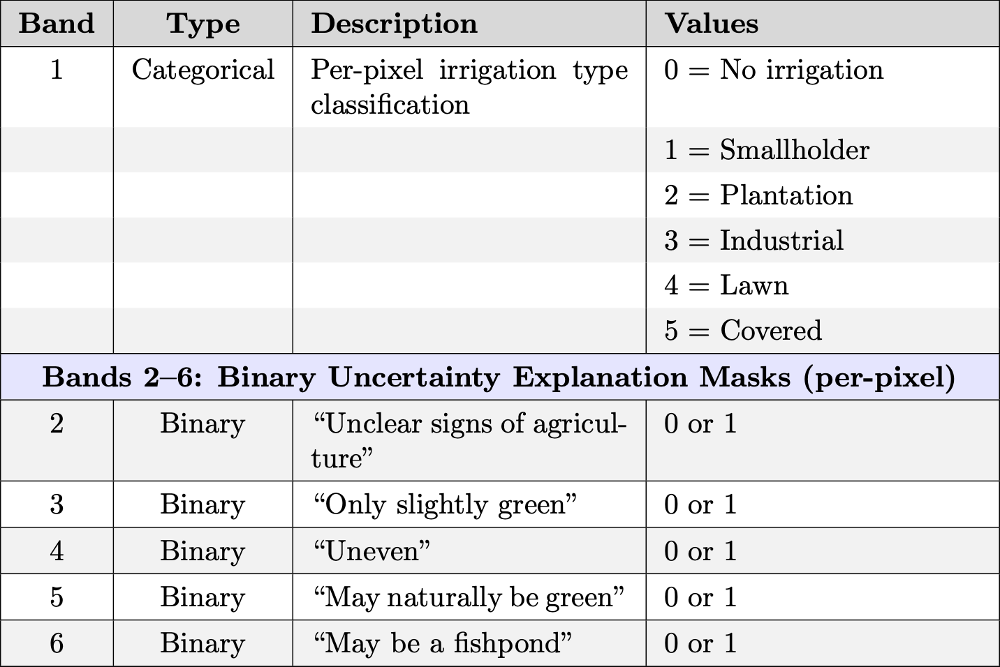

# Feature Downloading with Google Earth Engine

## Table of Contents
- [Feature Downloading with Google Earth Engine](#feature-downloading-with-google-earth-engine)
  - [Table of Contents](#table-of-contents)
  - [Overview](#overview)
  - [Prerequisites](#prerequisites)
  - [Google Cloud Setup](#google-cloud-setup)
    - [1. Create a GCP Project](#1-create-a-gcp-project)
    - [2. Create a GCS Bucket](#2-create-a-gcs-bucket)
    - [3. Create a Service Account](#3-create-a-service-account)
  - [Service account and GCS configuration](#service-account-and-gcs-configuration)
  - [Downloading Features](#downloading-features)
    - [Time Window Definition](#time-window-definition)
    - [Sentinel-2 Mosaic Retrieval](#sentinel-2-mosaic-retrieval)
      - [Atmospheric Correction](#atmospheric-correction)
      - [Retrieved Bands](#retrieved-bands)
      - [Handling Missing and Invalid Data](#handling-missing-and-invalid-data)
    - [Data Quality Assessment and Visualization](#data-quality-assessment-and-visualization)
      - [RGB Images Before Cloud Masking](#rgb-images-before-cloud-masking)
      - [RGB Images After Cloud Masking](#rgb-images-after-cloud-masking)
      - [NDVI Before Cloud Masking](#ndvi-before-cloud-masking)
      - [NDVI After Cloud Masking](#ndvi-after-cloud-masking)
    - [Stacking and Output](#stacking-and-output)
    - [Running the Download](#running-the-download)
    - [Dataset Location](#dataset-location)
  - [Creating Pixel-Level Labels](#creating-pixel-level-labels)

---

## Overview

The labels generated using Earth Collect do not include any features that can be used to train a model. We use Google Earth Engine (EE) to download features for model training, leveraging Google Cloud Storage (GCS) for storage and transfer.

---

## Prerequisites
- Access to Google Cloud Platform (GCP)
- Permissions to create projects, buckets, and service accounts
- Earth Engine and GCS APIs enabled

---

## Google Cloud Setup

> **Note:** The following setup is recommended if you plan to run downloads on an HPC (High-Performance Computing cluster) or a remote server, where browser-based authentication is not practical. If you are working locally on your own machine, you may be able to authenticate directly with your Google account using the Earth Engine Python API, and download data without setting up a GCS bucket or service account. See the [Earth Engine Python API authentication guide](https://developers.google.com/earth-engine/guides/python_install) for local setup instructions.

### 1. Create a GCP Project
- Go to [Google Cloud Console](https://console.cloud.google.com)
- Create a new project
- **Register your Google account and GCP project with [Google Earth Engine](https://signup.earthengine.google.com/)** (required to use the Earth Engine API; free for noncommercial use)
- Enable billing (required, but costs are minimal for this use case)
- Enable the following APIs:
  - Earth Engine API
  - Google Cloud Storage
  - Service Usage API

### 2. Create a GCS Bucket
- In the Cloud Console: **Storage > Buckets > Create**
- Choose:
  - Standard storage
  - A single region close to you or your HPC
- Example bucket name: `irr-earthengine-exports`

### 3. Create a Service Account
- Go to **IAM & Admin > Service Accounts**
- Click **Create Service Account**
- Name it (e.g., `earthengine-hpc-access`)
- Under roles, add:
  - Storage Object Admin
  - Earth Engine Resource Writer
- Click **Done**
- Go to your service account, create a JSON key, and download it

---

## Service account and GCS configuration

> **Note:** The configuration below is required for workflows using a service account and GCS bucket (recommended for HPC/remote use). For local-only workflows, you may not need these settings—refer to the [Earth Engine documentation](https://developers.google.com/earth-engine/guides/python_install) for local authentication options.

Store the following information in your `config.yaml` file:

```yaml
earthengine:
  service_account_key: secrets/earthengine-key.json
  bucket_name: irr-earthengine-exports
```

- `service_account_key`: Path to your downloaded service account JSON key
- `bucket_name`: Name of your GCS bucket

**Note:** The key is typically stored in the `secrets/earthengine-key.json` file (or as specified in your config).

---

## Downloading Features

> **Note:** This module builds dense Sentinel-2 time series for irrigation-labeled sites via Google Earth Engine (GEE). It supports 2016–2025 and applies server-side cloud screening, DOS haze correction, and local NDVI/EVI/NDWI. Each time window uses the single best scene (no pixel-wise mosaic) to avoid seam artifacts.

To download features, we first load in all the irrigated images and their (lat, lon, date, ID) data from `data/labels/labeled_surveys/random_sample/latest_irrigation_table.csv`. For each site, we generate a fixed-length time series centered on the labeled date.

### Time Window Definition

We create 37 consecutive 10-day windows around the labeled date (±18 windows).
The middle window contains the labeled date.



Each window selects one Sentinel-2 scene with the lowest cloud fraction inside the 100×100 region (no pixel-level mosaic within the window).

Optionally, set `START_JANUARY` to `True` in `download_sentinel2_mosaics.py` so that all time series begin on January 1st of the year of the image.

### Sentinel-2 Mosaic Retrieval

We retrieve Sentinel-2 L1C imagery from COPERNICUS/S2_HARMONIZED [Google Earth Engine](https://developers.google.com/earth-engine/datasets/catalog/COPERNICUS_S2_HARMONIZED) and pair each scene with cloud probabilities from COPERNICUS/S2_CLOUD_PROBABILITY[Google Earth Engine](https://developers.google.com/earth-engine/datasets/catalog/COPERNICUS_S2_CLOUD_PROBABILITY). 

For every 10-day window in the 37-step series, we search for scenes intersecting the site, attach the s2cloudless probabilities by system:index, and build a server-side SCL for that scene. Our SCL uses three states—7 for clear/other, 9 for cloud, and 10 for cirrus—derived from the s2cloudless field with light spectral guards to remove speckles. We then score cloud fraction over the AOI and select a single lowest-cloud scene for that window (no pixel-wise mosaicking), followed by a simple DOS (dark-object subtraction) to stabilize reflectance.

For each window we export two rasters to GCS: an unmasked cube (<prefix>.tif) containing the ten reflectance bands (B2, B3, B4, B5, B6, B7, B8, B8A, B11, B12) plus the SCL (11 bands total), and a masked cube (<prefix>_masked.tif) where cloud/cirrus pixels are written as NO_DATA = −9999 in both reflectance and SCL. Locally we load these exports, compute NDVI, EVI, and NDWI, and stack all 37 windows into a consistent time series. The final per-step layout used for modeling and visualization is 14 bands: the 10 reflectance bands, the three indices (scaled by 10,000), and the SCL.

#### Atmospheric Correction

Because we are using Sentinel-2 L1C data, which does not include atmospheric correction (L2A data does include atmospheric correction, but is unavailable for years 2016-2018), we perform the following steps on each Sentinel-2 L1C mosaic to perform our own atmospheric correction:

- Pseudo-Atmospheric Correction (DOS):
    - Each Sentinel-2 L1C mosaic is first corrected using a simple Dark Object Subtraction (DOS) algorithm on B2/B3/B4/B8. This reduces atmospheric haze and brings the reflectance values closer to L2A surface reflectance.

- Custom Scene Classification Layer (SCL):
    - After atmospheric correction, a custom SCL (Scene Classification Layer) band is generated based on NDVI, NDWI, NDSI, and brightness thresholds. This SCL simulates the L2A official product, enabling masking of clouds, shadows, water, snow/ice, vegetation, and more, and allows downstream analysis to use L2A-like quality masks for each time step.

#### Retrieved Bands

We then take the original Sentinel-2 bands and use them to create 3 vegetation bands. The final .tif image per window contains the following bands:

- **10 Original Sentinel-2 Bands**: B2, B3, B4, B5, B6, B7, B8, B8A, B11, B12
- **NDVI: Normalized Difference Vegetation Index**: Measures green vegetation density, computed from NIR and Red bands (B8, B4). We store this value scaled by 10000 for storage efficiency.

$$
\text{NDVI} = 10000 \times \frac{\text{NIR} - \text{Red}}{\text{NIR} + \text{Red}} \in [-10000, 10000]
$$

- **EVI: Enhanced Vegetation Index**: Similar to NDVI, but slightly better in areas with dense canopy or haze. Computed from NIR, Red, and Blue bands (B8, B4, B2). We store this value scaled by 10000 for storage efficiency.

$$
\text{EVI} = 10000 \times 2.5 \times \frac{\text{NIR} - \text{Red}}{\text{NIR} + 6 \times \text{Red} - 7.5 \times \text{Blue} + 1} \in [-10000, 10000]
$$

- **NDWI: Normalized Difference Water Index**: Detects moisture changes in vegetation and soil. Computed from NIR and SWIR1 bands (B8, B11). We store this value scaled by 10000 for storage efficiency.

$$
\text{NDWI} = 10000 \times \frac{\text{NIR} - \text{SWIR}}{\text{NIR} + \text{SWIR}} \in [-10000, 10000]
$$

- **SCL(Scene Classification) Band**: Scene classification for cloud, shadow, water, vegetation, etc. The SCL band contains integer values between 1 and 11, representing different scene classes. Note that pixels with no data or data that has been masked due to clouds or cloud shadows (as determined by `s2cloudless`) are set to NO_DATA = -9999.
  - 0 - No Data
  - 1 - Saturated/Defective
  - 3 - Cloud Shadow
  - 7 - Clear/other
  - 9 - Cloud High Probability
  - 10 - Thin Cirrus
  - 11 - Snow/Ice

#### Handling Missing and Invalid Data

For a particular window, data may be missing (if there is no satellite imagery within that timeframe) or invalid (if there are clouds covering the image)

- **Cloud/cirrus** The server-masked product sets reflectance and SCL to −9999 where SCL∈{9,10}. Locally we also enforce consistency when reading the masked file (reflectance forced to −9999 wherever SCL is −9999) to eliminate residual.

- **Missing Images** In rare cases, a time window may have no available satellite imagery. When this occurs, we write an all-NO_DATA slice and record cloud_fraction = 1.0 in JSON.

- **Soft Drop** If a step has a very large NO_DATA fraction (e.g., ≥80%), we keep the T=37 timeline but write that slice as all −9999 and flag it in JSON. This preserves temporal alignment for modeling while avoiding most-empty slices.

### Data Quality Assessment and Visualization

The downloaded time series data can be visualized and analyzed for quality assessment using the provided visualization tools. These tools help researchers understand temporal patterns, data coverage, and seasonal variations in the satellite imagery.

#### RGB Images Before Cloud Masking
Shows the raw Sentinel-2 RGB composite (B4=Red, B3=Green, B2=Blue) before cloud masking is applied:



#### RGB Images After Cloud Masking
Demonstrates the improvement in image quality after cloud masking, with cloudy pixels set to transparent:



#### NDVI Before Cloud Masking
Shows NDVI values across all time steps without cloud masking, revealing temporal patterns in vegetation:



#### NDVI After Cloud Masking
Displays clean NDVI time series with cloud-masked pixels removed, providing clear vegetation dynamics:



These visualizations help researchers:
- Assess data quality for machine learning training
- Identify optimal time periods for irrigation detection
- Understand seasonal patterns in satellite data coverage
- Validate the effectiveness of cloud masking algorithms

### Stacking and Output

The per-window GeoTIFFs live in GCS; we then build fixed-length local stacks:

- Per step layout (local): 10 reflectance + 3 indices + 1 SCL = 14 bands

- Stack shape: (T, B, H, W) = (37, 14, 100, 100) → flattened to (37×14=518, 100, 100) in the final GeoTIFF.

**Files Stored**: For each labeled image, we save four files to our data folder:

- `data/features/{uid}_{site}_{YYYY.MM.DD}_image.tif` – BEFORE stack (unmasked scene + indices)
- `data/features/{uid}_{site}_{YYYY.MM.DD}_label.tif` – AFTER stack (masked scene + indices)
- `data/features/{uid}_{site}_{YYYY.MM.DD}_image.json` – metadata per step (cloud fraction, mean NDVI/EVI/NDWI, etc.)
- `data/features/{uid}_{site}_{YYYY.MM.DD}_label.json` – same fields for AFTER

### Running the Download
Using a single CPU, the dataset takes a little over a day to download. To run this on the HPC, create a `.sh` file in `src/features` with your desired headers & the commands below:

```shell
source ../../env/bin/activate

## run python 
python3 download_sentinel2_mosaics.py
```

Then use the [Slurm job scheduler](https://slurm.schedmd.com/sbatch.html) to schedule the download.

### Dataset Location
The dataset is located on the cluster at `/home/waves/data/smallholder-irrigation-dataset/data/`. There are three versions: 

|Folder Name|Date Downloaded|
|-----------|-----------|
|features|August 5th, 2025|
|features_v2|October 12, 2025|
|features_v3|November 9, 2025|

A note on the differences between versions:
- `features` downloaded everything locally and also to the Google Cloud Bucket, which made the download speed exponentially slower (took around a week to download all sites)
- `features_v2` downloads everything locally (bypassing Google Cloud Bucket), which makes downloading a lot easier. It takes a little less than a 1 minute to download each row of `latest_irrigation_table.csv`, whereas it took approximately 15 minutes in the previous download.
  - Modifications were made to `latest_irrigation_table.csv` between downloads, so the IDs in `features` do not match with those in `features_v2`
- `features` has some issues with the cloud masking in which a lot of images were mostly blank, save a few small patches of colored pixels. Some updates to improve the cloud masking in `features_v2`. Also, images more than 80% blank are dropped in `features_v2`, whereas they were kept in `features`
- `features_v3` uses the same download logic as `features_v2`, except all time windows begin on January 1st.

## Creating Pixel-Level Labels

For each Sentinel-2 image, we classify each pixel as irrigated or not. For irrigated pixels, we also specify the type of irrigation, the labeler's level of certainty, and reasons for any uncertainty. To do this, we overlay labeled polygons on an eight-band `.tif` file, with the following bands. For mixed pixels, the label is given to the class that is in the center of the pixel. 



The first band specifies the type of irrigation, if any, and the second is a simple binary mask of the first. These bands only include areas as irrigated if they clear a certain threshold of certainty, with the default being >=3. 

The next five bands are binary masks indicating the reasons for any uncertainty of the irrigation classification, with each band corresponding to a different uncertainty explanation. The last band indicates the certainty score, with 5 being high certainty, 1 being low certainty, and 0 indicating no irrigation. These bands include all areas regardless of their level of certainty.

The script will then create a folder `~/data/dataset/labels` containing all labels. For each input image, it will create a label file in format `uniqueID_siteID_date_labeler.tif` where
- `uniqueID` is a unique identifier for the label
-  `siteID` is the ID of the site
-  `date` is the date of the image (format `YYYY.MM.DD`)
-  `labeler` is the labeler's initials

To run this script, navigate to the `src` directory and run

```{bash}
python3 features/create_label_band.py
```

This will create a folder `~/data/dataset/labels` with all corresponding labels.

To run tests for this script, run the following command from this directory:

```{bash}
python -m unittest tests/test_create_label_band.py
```
