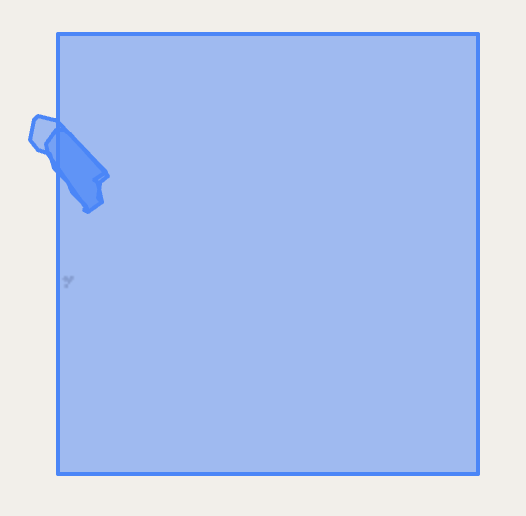
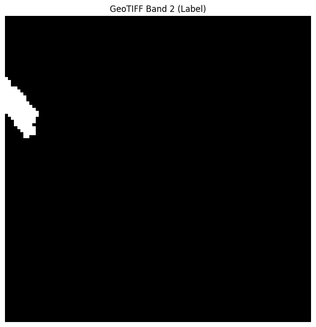

# Feature Downloading with Google Earth Engine

## Table of Contents
- [Feature Downloading with Google Earth Engine](#feature-downloading-with-google-earth-engine)
  - [Table of Contents](#table-of-contents)
  - [Overview](#overview)
  - [Prerequisites](#prerequisites)
  - [Google Cloud Setup](#google-cloud-setup)
    - [1. Create a GCP Project](#1-create-a-gcp-project)
    - [2. Create a GCS Bucket](#2-create-a-gcs-bucket)
    - [3. Create a Service Account](#3-create-a-service-account)
  - [Service account and GCS configuration](#service-account-and-gcs-configuration)
  - [Downloading Features](#downloading-features)
  - [Creating Pixel-Level Labels](#creating-pixel-level-labels)

---

## Overview

The labels generated using Earth Collect do not include any features that can be used to train a model. We use Google Earth Engine (EE) to download features for model training, leveraging Google Cloud Storage (GCS) for storage and transfer.

---

## Prerequisites
- Access to Google Cloud Platform (GCP)
- Permissions to create projects, buckets, and service accounts
- Earth Engine and GCS APIs enabled

---

## Google Cloud Setup

> **Note:** The following setup is recommended if you plan to run downloads on an HPC (High-Performance Computing cluster) or a remote server, where browser-based authentication is not practical. If you are working locally on your own machine, you may be able to authenticate directly with your Google account using the Earth Engine Python API, and download data without setting up a GCS bucket or service account. See the [Earth Engine Python API authentication guide](https://developers.google.com/earth-engine/guides/python_install) for local setup instructions.

### 1. Create a GCP Project
- Go to [Google Cloud Console](https://console.cloud.google.com)
- Create a new project
- **Register your Google account and GCP project with [Google Earth Engine](https://signup.earthengine.google.com/)** (required to use the Earth Engine API; free for noncommercial use)
- Enable billing (required, but costs are minimal for this use case)
- Enable the following APIs:
  - Earth Engine API
  - Google Cloud Storage
  - Service Usage API

### 2. Create a GCS Bucket
- In the Cloud Console: **Storage > Buckets > Create**
- Choose:
  - Standard storage
  - A single region close to you or your HPC
- Example bucket name: `irr-earthengine-exports`

### 3. Create a Service Account
- Go to **IAM & Admin > Service Accounts**
- Click **Create Service Account**
- Name it (e.g., `earthengine-hpc-access`)
- Under roles, add:
  - Storage Object Admin
  - Earth Engine Resource Writer
- Click **Done**
- Go to your service account, create a JSON key, and download it

---

## Service account and GCS configuration

> **Note:** The configuration below is required for workflows using a service account and GCS bucket (recommended for HPC/remote use). For local-only workflows, you may not need these settings—refer to the [Earth Engine documentation](https://developers.google.com/earth-engine/guides/python_install) for local authentication options.

Store the following information in your `config.yaml` file:

```yaml
earthengine:
  service_account_key: secrets/earthengine-key.json
  bucket_name: irr-earthengine-exports
```

- `service_account_key`: Path to your downloaded service account JSON key
- `bucket_name`: Name of your GCS bucket

**Note:** The key is typically stored in the `secrets/earthengine-key.json` file (or as specified in your config).

---

## Downloading Features

> **Note:** This section describes the workflow for exporting dense Sentinel-2 mosaics for all label points using the Earth Engine API and Google Cloud Storage. The pipeline is designed for time series sampling at 10-day intervals across each year, with robust handling for missing or cloudy images.

### How it works

- For every point in `data/labels/labeled_surveys/random_sample/latest_irrigation_table.csv`, the script generates ~36 time windows (10-day intervals) spanning the full year, referenced to the site’s label date.

- For each time window:
  - Checks if the corresponding `.tif` file already exists in the Google Cloud Storage (GCS) bucket (matching the folder structure used locally). If so, it skips to the next.

  - If no valid Sentinel-2 image is found (e.g., due to clouds), a blank placeholder TIF is generated and stored (see below).

  - Otherwise, an Earth Engine export task generates a Sentinel-2 surface reflectance mosaic (including the QA60 cloud mask band), which is then downloaded from GCS.

- Each time window always produces a `.tif` file (either actual data or a blank placeholder) and a corresponding `.json` metadata file.

### Handling missing data (blank images)

- If no data is available for a window (e.g., persistent clouds), a blank placeholder image is copied into place using `generate_blank_tif.py`.

- Metadata for missing data windows includes `"missing_data": true`.
### Viewing/Exporting

- Command-line utility to visualize Sentinel-2 .tif images (including blank ones) as RGB composites, with warnings for all-blank/placeholder.

- Use `visualize_tif.py` to view downloaded TIFs as RGB images.

- `python src/features/visualize_tif.py data/features/site_-15.04_26.69_2023/s2_-15.04_26.69_2023-01-01_2023-01-11.tif --bands 3 2 1 --title "My RGB Plot"`

### File location

- Input labels:
`data/labels/labeled_surveys/random_sample/latest_irrigation_table.csv`

- Downloaded features & metadata:
`data/features/site_{lat}_{lon}_{year}/s2_{lat}_{lon}_{start}_{end}.tif`
`data/features/site_{lat}_{lon}_{year}/s2_{lat}_{lon}_{start}_{end}.json`

- Blank images:
`data/features/blank.tif`

## Creating Pixel-Level Labels

For each Sentinel-2 image, we need to classify each pixel within the image as irrigated or not irrigated. To do this, we take the labeled polygons corresponding to the image and classify pixels as irrigated if a polygon overlaps with the center of a pixel, otherwise, we label it as not irrigated.

Here is an example of an input image location and its corresponding labeled polygons:



Then, the label image would be a binary mask like the following


To run this script, navigate to the `src` directory and run

```{bash}
python3 features/create_label_band.py
```

This will create a folder `~/data/dataset/labels` with all corresponding labels.

After downloading the Sentinel-2 images, we then create labels for each pixel. To do this, we first iterate through all the `.tif` mosaic files, which are assumed to be located at `data/dataset/images`.

For each file, we extract the file data using (latitude, longitude, offset, start date, and end date) from the filename to retrieve the survey date. Then, we extract the `.tif` metadata, such that we can create labels at the resolution of the original `.tif`.

Then, we must link the (latitude, longitude, survey date) to its corresponding labelled polygons (`.geojson` file). 

Then, we retrieve the polygons from the corresponding `.geojson` file, only retrieving polygons greater than a specified certainty (default is 4+). We store these polygons in a `geopandas.geodataframe.GeoDataFrame`, and rasterize these polygons at the same resolution of the original image, as a binary mask – a given pixel is 1 if the polygon overlaps with it, 0 otherwise. Note that if a polygon only partially overlaps with a pixel, it will count as 1 only if the it overlaps with the center of the pixel.

Then, we save the binary mask into a new file, located in `data/dataset/labels`, with the filename the same as the original image.